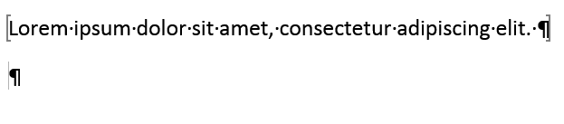
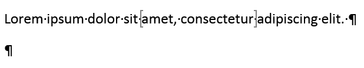

```{r setup, include=FALSE, message=FALSE, warning=FALSE}
knitr::opts_chunk$set(echo = TRUE)
library(ReporteRs)
library(magrittr)
if(!require(filelink))
  file_data_uri <- function(file, label, mime){invisible()}

options("ReporteRs-fontsize" = 11)
```


## Use bookmarks to replace content

`docx` objects can generate Word documents using bookmarks as placeholders to insert contents. 

Use the function `docx` with argument **template** to create a document based on an Word document where bookmarks are located. 

Functions `addFlexTable`, `addPlot`, `addParagraph` and `addImage` can send respective outputs into these bookmarks. All of them have an optional argument named `bookmark` corresponding the the bookmarked content to replace.

Content (plots, paragraphs or images) will replace the whole paragraph containing the bookmark. 

When used with `addFlexTable`, content (table) will be **added after** the paragraph containing the bookmark. 

> In a Word document, paragraphs and tables are different containers; 
> a Word table contains paragraphs but is not a paragraph object. 
> Because Word bookmarks are located in paragraphs, it is not 
> possible to bookmark a table. 

## Illustration

We will use a specific file as template `bookmark_example.docx` containing various styles and bookmarks located in the package.


```{r message=FALSE, warning=FALSE}
library( ReporteRs )

target_file <- "bookmark_example.docx" # file to produce 

template <- system.file(package = "ReporteRs", 
  "templates/bookmark_example.docx" ) # template example

doc = docx( template = template )
styles(doc)
```
```

```{r echo=FALSE}
file_data_uri(file = template, label = basename(template) )
```


Let use `iris` to illustrate tables and graphics.

```{r message=FALSE, warning=FALSE}
library( ggplot2 )

ft <- vanilla.table( data = head(iris), add.rownames=TRUE )

myplot1 <- ggplot(data = iris, aes(Sepal.Length, Petal.Length, color = Species), 
                  alpha = I(0.7) )
```

Use `list_bookmarks` to check available bookmarks in the template document:

```{r message=FALSE, warning=FALSE}
list_bookmarks(doc)
```

Finally, add all elements into the report and write it into file `target_file`.  

```{r message=FALSE, warning=FALSE}
library( magrittr )
doc %>%
  addParagraph( value = "Jane Doe", stylename = "small", bookmark = "AUTHOR" ) %>%
  addParagraph( value = "John Doe", stylename = "small", bookmark = "REVIEWER" ) %>%
  addFlexTable( flextable = ft, bookmark = "DATA" ) %>%
  addPlot( fun = print, x = myplot1, bookmark = "PLOT" ) %>%
  writeDoc( file = target_file)
```

```{r echo=FALSE}
file_data_uri(file = target_file, label = basename(target_file) )
```


## Notes 

### Declare bookmark in Word

To be used with a `docx` object, bookmark must be placed **into** a single paragraph, you have to add the bookmark **on a portion of a text in a paragraph**. 

> If placed along 1 or more paragraphs, produced document will be corrupted. 

To add a bookmark that ReporteRs will use later, do not add the bookmark on the whole paragraph** but rather in the paragraph. 

This operation is to be done in Word, by editing the template of the document.

Below an example that will **not** work (bookmark brackets are on the whole paragraph):



Below an example that will work (bookmark brackets are not on the whole paragraph):



### Nested table and table headers

Word is not able to repeat header cells if table is nested in another table.

In a Word document, if a table contains a bookmark used to add another table (therefore creating a **nested table**), table headers won't be repeated along 
pages. 

